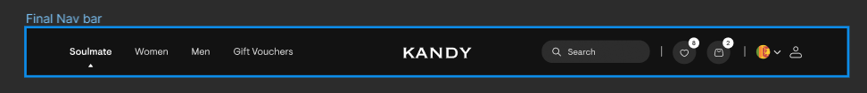
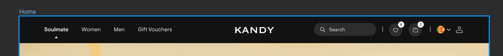
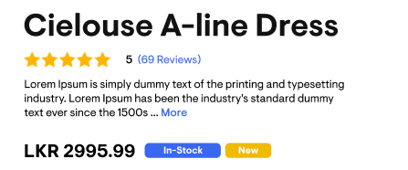
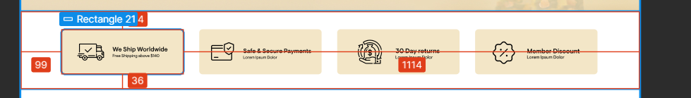
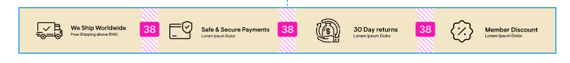

# Style Guidelines

## General

1. Try to identify use cases required to use flex and grid as much as possible.

2. If the designer has not used out of the box values from TailwindCSS choose the rounded-down TailwindCSS value. Consistently.

## Layout

1. Always choose `grid` when you have a 2 dimensional layout.

2. Always choose `grid-cols` when you have a horizontal layout that spans the whole width of the parent `&&` **child width is not defined by the child**.

3. If a child decalres their own width choose `flex` with `justify-between`.

#### Note:

- When a child do not decalre their own width the width has to be controlled by `grid-cols` and `grid-gaps`=.
- When a child decalres their own width the spacing has to be controlled by the `flex` properties of the parent.

- Here the product card sizes have been defiend by the container and the spacing is uniform that is controlled by a `grid-gap`.

3. If a horizontal layout does not span the entire width but the children are either centerd or in a side, choose `flex` along with `gap-x`.

4. In sub-containers let children dictate size of the sub-container.

> A sub-container is a container that was created to define layout for a set of children that should be isolated/grouped from a main container.

> A sub-container is usually a child of a main container that allows container to layout its children.

- Here the Soulmate, Men, Women etc... is in a invisible subcontainer

5. Always let the browser derived widths be the width of main containers.

- Here, the navbar width is browser derived.

6. Let the height of children and padding define the height of containers the where possible.

- The height of the navbar is `derived` by the container-children paddings and height of the children.

7. Use normal static layout with margin-top properties to place elements in vetical layouts that are aligned to a side.

- Here the spacing between the main heading, the reviews, and the pricing elements are in a static layout and each elements has a margin-top defining their spacing.

8. Always choose `grid-cols-1` and `gap-y` to declare the spacing of a vertical list of related items.

9. Reduce the extent flex declares the spacing.

10. Always try to let the parent layouts declare the dimensions of the children. That way we can make things responsive easily.

11. Always use padding for horizontal and vertical spacing between parent and children.

- Make sure the padding is consistent across pages

- Here the spacing between children and parent has to established using padding.

12. DO NOT USE MARGIN to define the spacing between children. Either let it be a flex gap or a explicitly gap defined by `gap` properties.

- Here the inter-child gap is obtained by a flex gap

13. When you need a custom property, add it to the `tailwind.config.js` first.
